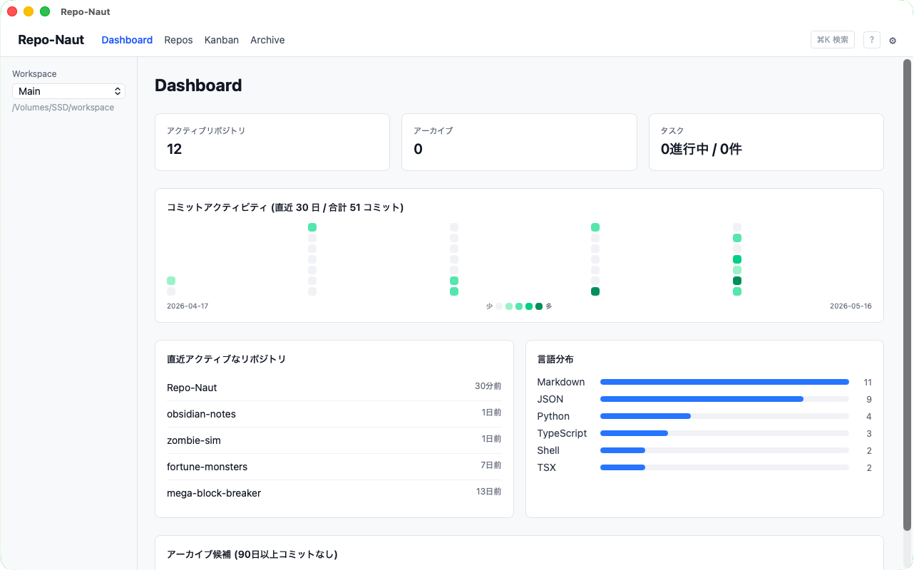
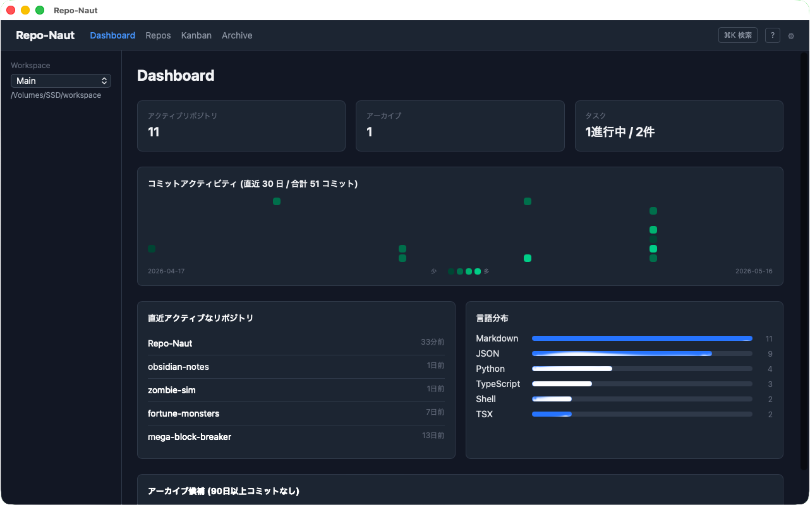
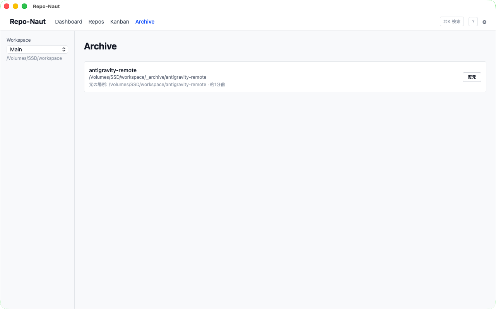

# 思いつきでアプリ開発を始めるせいでローカルリポジトリがとっちらかって大変なので、リポジトリを一覧で確認できて各ディレクトリ起点でターミナルやエディタを開いたり簡単なgit操作ができたりプロジェクトをアーカイブしたりできるデスクトップアプリをつくった

## はじめに

思いつきでアプリを作り始めるのが癖になっている。「このツール便利そう」「このUIやってみたい」「あのAPIで何か作れそう」——そのたびに `git init` して、しばらく熱中して、ある程度形になったら満足して次のアイデアへ移る。

気づいたら `~/projects` の中がこういう状態になっていた。

```
projects/
├── awesome-tool/
├── awesome-tool-v2/         # v2作ったやつ
├── awesome-tool-v2-backup/  # なんで作ったか忘れた
├── another-idea/
├── another-idea-2024/
├── client-a-lp/
├── client-b-app/
├── test-react-server-components/  # 触っただけ
├── test-tauri/                    # これが今回につながる
...（以下20個ぐらい続く）
```

どこに何があるかわからない。気になったリポジトリの状態を確認するたびにターミナルを開いて `cd` して `git log` して……を繰り返す。古くなったプロジェクトは邪魔だけど、もしかしたら後で見返すかもしれないから削除もできない。

「リポジトリを管理するアプリがあればいいのに」と思って探してみると、GitKraken や Sourcetree などの Git GUI クライアントはあるが、どれも「1つのリポジトリを深く操作する」ためのツールで、「大量のリポジトリをざっくり俯瞰して管理する」用途ではない。

ないなら作ろう、ということで作った。

---

## つくったもの

**Repo-Naut** というデスクトップアプリ。

ローカルにある複数の Git リポジトリをカード形式で一覧表示して、エディタやターミナルの起動・簡単な git 操作・古いプロジェクトの整理ができる。macOS 向けに v0.1.0 をリリース済み。

https://repo-naut.pages.dev/







---

## 主な機能

### ワークスペーススキャン

ルートディレクトリ（`~/projects` など）を登録するだけで、配下の Git リポジトリを自動検出してカード一覧に表示する。

各カードには最新コミットメッセージ・現在のブランチ・ahead/behind・未コミット数などが表示される。また `.git/HEAD` の変更をファイルウォッチャーで監視しているので、ターミナルでコミットするとカードの情報が自動で更新される。

複数 Workspace の登録・切り替えにも対応している（仕事用・個人用など分けて管理できる）。

### エディタ・ターミナルを即起動

カードのボタンから、登録済みのエディタ（VS Code / Cursor / Zed など）やターミナルを直接起動できる。プリセットから追加するか、任意のコマンドを登録できる。

「Finder でプロジェクトを探して、ターミナルで `cd` して、`code .` する」という手順が「カードのボタンを押す」だけになる。些細だけど、毎日やるとじわじわ効く。

### 簡単な git 操作

カードから `git pull` / `git fetch` を実行できる。結果はモーダルで確認できる。ブランチの一覧表示・切り替えも同様にアプリ内で完結する。

本格的な Git GUI クライアントではないが、「ちょっと pull したい」程度の操作にちょうどいい。

### アーカイブ機能

古いプロジェクトをワークスペース内の `_archive/` ディレクトリへ移動できる。アーカイブ時に最終コミットの情報・元のパスをメタデータとして保存し、必要なら復元できる。

正直なところ、「アーカイブ」にするより普通に削除してしまえば良かったかもしれない。ゴミ箱に入れる感覚で使えればそれで十分だったし、復元機能まで実装したわりには使う場面が少ない。作るのが楽しくなってしまって、要らない機能まで作り込んだ典型例だと思っている。

### カンバンボード

Todo / In Progress / Review / Done の 4 カラムで、リポジトリ横断のタスク管理ができる。タスクをリポジトリに紐付けて「どのプロジェクトの作業か」を関連付けられる。

これも「色気が出てつけてしまった」機能のひとつで、本当に必要だったかどうかは自分でも微妙だと思っている。GitHub Issues や他のタスク管理ツールを既に使っている人には余計だし、タスク管理だけで十分な機能を作り込もうとするとキリがない。ただ個人的には「リポジトリカードから直接タスクを見る」という体験が意外と便利だったので、今は使っている。要る人には要るし要らない人には要らない、という感じ。

### その他

- GitHub PAT 連携（PAT を OS キーチェーンに保存して PR 数・Issue 数をカードに表示）
- コマンドパレット（`Cmd+K`）とキーボードナビゲーション
- ダッシュボード（直近 30 日のコミット数ヒートマップ・言語分布・アクティブリポジトリランキング）
- タグ・メモ（Markdown）
- データのエクスポート / インポート

---

## 技術スタック

| レイヤー | 採用技術 |
|---|---|
| フレームワーク | Tauri v2 |
| フロントエンド | React 18 + TypeScript + Vite + Tailwind CSS v4 |
| 状態管理 | TanStack Query（サーバー状態）+ Zustand（UI 状態） |
| DnD | @dnd-kit |
| バックエンド（Rust） | git2 / notify / rayon / keyring / reqwest |
| データ永続化 | JSON ファイル 3 本（SQLite 不使用） |

---

## デスクトップアプリ開発が初めてでも Tauri の開発体験はよかった

今回が初めてのデスクトップアプリ開発だった。

最初は Electron も候補にあったが、「メモリ消費が大きい」「バイナリが重い」という話を見てやめた。常駐して使うツールなのでここは譲れなかった。Tauri はそのあたりが Electron より優れているという評判があり、フロントエンドは React + TypeScript で書けるという点も決め手になった。

Rust はほぼ未経験だったが、バックエンドの主要な処理（Git 操作・ファイル監視・データの読み書き）は Tauri が提供するクレートと周辺エコシステムのおかげで、Rust をちゃんとわかっていなくても形にできた。

開発の流れとしては、React 側からは `invoke()` で Rust の関数を呼ぶだけ。React を書き慣れていれば UI の部分はほとんどいつも通りで、ネイティブ機能が必要な箇所だけ Rust を書く、という分担が自然にできた。ホットリロードも効くのでフロントエンドの開発体験はほぼ Web 開発と同じだった。

「Rust を完全に理解してから作る」ではなく、「必要な機能を Rust で書いて、コンパイラに怒られながら直す」というスタイルで進められたのは良かった。Tauri のドキュメントは v1 → v2 の移行で古い情報が多かったり内容が薄かったりする部分もあったが、概ね困ることなく開発できた。

---

## 詰まったところ：ビルド後の PATH 問題

開発中は全く問題なかったのに、ビルドして `.dmg` をインストールして起動したら、エディタやターミナルの起動ができなくなった。

原因は環境変数 `PATH` の問題だった。

開発時（`pnpm tauri dev`）は親プロセスのシェルが `PATH` を引き継いでくれているので `code`（VS Code）や `cursor` などのコマンドが普通に見つかる。ところが `.dmg` からインストールしたアプリを Finder からダブルクリックで起動すると、シェルを経由しない起動になり `PATH` がすっからかんに近い状態になる。`code` も `cursor` もどこにいるかわからない。

解決策は、Rust 側でコマンドを実行するときにシェル経由（`sh -c`）で呼び出すか、よく使われるパスを明示的に探しに行くか、という方法になる。今回は後者で対応した。`/usr/local/bin`・`/opt/homebrew/bin`・`/usr/bin` などを自前で探索してコマンドを見つける実装にした。

macOS でこれだけ手がかかるので、Windows 版を出すとなると PATH 問題が macOS の比ではない（コマンドプロンプト・PowerShell・WSL など環境がバラバラ）。デバッグに使える環境の準備から始めないといけないと思うと腰が重くなって、今のところ Windows 版の開発はペンドしている。

---

## 実装で工夫したところ

### rayon でリポジトリスキャンを並列化

ワークスペース配下を再帰的に `.git` ディレクトリで探索し、見つかったリポジトリを `git2` クレートで読み込んでいる。

プロジェクトが多いと直列処理では時間がかかるため、`rayon` の並列イテレータで処理している。`rayon` は Rust の並列処理ライブラリで、シングルスレッドの `iter()` を `par_iter()` に書き換えるだけで並列になる。Rust の所有権モデルのおかげでスレッドセーフが保証されているのは素直にすごいと思った。

```rust
// par_iter() に替えるだけで並列スキャンになる
found_paths
    .par_iter()
    .filter_map(|path| scan_single_repo(path, &meta_map, &excluded_dirs).ok())
    .collect()
```

### notify クレートでファイル変化を検知 → 自動再スキャン

`notify` クレートでワークスペースの `.git/HEAD` と `.git/refs/heads/` だけを監視している。`node_modules` や `target`、`dist` などのディレクトリへの書き込みは無視する設定にしないと、ビルドのたびに再スキャンが走って使い物にならない。

変化を検知したら 800ms の debounce を挟んでから TanStack Query の `invalidateQueries` を叩く仕組みで、フロントエンド側は自動的にリポジトリ一覧を再取得する。

### GitHub PAT を OS キーチェーンに保存

GitHub の PAT（Personal Access Token）は JSON ファイルに平文で書きたくなかった。`keyring` クレートを使うと macOS の Keychain・Windows の Credential Manager に安全に保存できる。バックアップのエクスポートにも含めない設計にした。

### カンバンの order 管理（f64 中間挿入）

カンバンのタスクをドラッグで並び替えるとき、`order` フィールドを整数（0, 1, 2...）で管理すると、移動のたびに全タスクの `order` を振り直す更新が必要になる。

これを避けるために `order` を `f64` にして中間挿入で管理している。1.0 と 2.0 の間に挿入するなら 1.5、1.0 と 1.5 の間なら 1.25……というように、並び替えのたびに既存タスクの `order` を変更せずに済む。

理論上は精度が尽きるが、実用上は問題になる前に再採番すれば良い。この手法は Figma のドキュメントで読んで知ったもので、実装してみたら思ったより素直に動いた。

---

## 他の人もこんな問題を抱えているのか？

正直なところ、「このアプリが他の人にも刺さるかどうか」はよくわからない。

「思いつきでリポジトリをたくさん作る」という癖自体が、そこまで普遍的ではないかもしれない。きちんとした開発フローで動いているチームや、1〜2 個のプロジェクトに集中して取り組んでいる人には不要なツールだと思う。

一方で、個人開発者・フリーランスエンジニアで、複数のクライアント案件や個人プロジェクトを並行して持っている人には「あるある」感があるんじゃないかとも思っている。

自分が使いたいものを作った、というのが正直なところで、公開したのは「同じ問題を抱えている人がいたら使ってほしい」という気持ち半分と、「Tauri 製デスクトップアプリを macOS 向けにリリースする」経験を積みたかった気持ち半分だ。

---

## まとめ

- **Repo-Naut**: ローカルの Git リポジトリをカード形式で一元管理するデスクトップアプリ
- Tauri v2 + React + TypeScript + Rust で実装
- macOS 向けに v0.1.0 をリリース済み（GitHub Releases から `.dmg` をダウンロードできます）
- 初デスクトップアプリ開発だったが Tauri の開発体験は良かった
- ビルド後の PATH 問題など、Web 開発とは異なるハマりどころがある
- Windows 版はいつかやりたいが、ペンド中

ランディングページと GitHub リポジトリへのリンクを貼っておきます。同じような課題を感じている方がいればぜひ試してみてください。

- LP: https://repo-naut.pages.dev/
- GitHub: https://github.com/anonym-studio/Repo-Naut/releases/tag/v0.1.0
