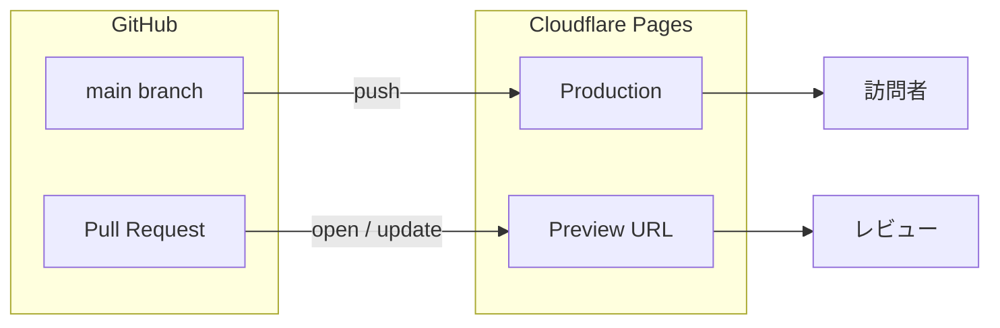

**バージョン**: 1.0.0  
**作成日**: 2026-05-16  
**更新日**: 2026-05-16  
**ステータス**: Draft（準備完了・コンテンツ未実装）

### 変更履歴

| バージョン | 内容 |
|---|---|
| 1.0.0 | 初版。`landing/` ディレクトリ構成・技術選定・Cloudflare Pages デプロイ方針・デスクトップアプリとの分離ルールを定義 |

---

## 目次

1. [目的とスコープ](#1-目的とスコープ)
2. [リポジトリ内の位置づけ](#2-リポジトリ内の位置づけ)
3. [技術スタック](#3-技術スタック)
4. [ディレクトリ構成](#4-ディレクトリ構成)
5. [デスクトップアプリとの分離ルール](#5-デスクトップアプリとの分離ルール)
6. [ローカル開発](#6-ローカル開発)
7. [Cloudflare Pages デプロイ](#7-cloudflare-pages-デプロイ)
8. [コンテンツ要件（今後実装）](#8-コンテンツ要件今後実装)
9. [未決定事項](#9-未決定事項)

---

## 1. 目的とスコープ

### 1-1. 目的

| 項目 | 内容 |
|---|---|
| 対象 | **Repo-Naut** 公開用ランディングページ（LP） |
| ホスティング | **Cloudflare Pages**（静的サイト） |
| 役割 | 製品紹介・機能概要・ダウンロード導線（GitHub Releases 等へのリンク） |
| スコープ外 | Tauri デスクトップアプリ本体の UI・バックエンド・データ永続化 |

LP は **Web ブラウザ向けの静的フロントエンド** のみを扱う。アプリのインストール・実行はデスクトップビルド成果物（`docs/build-guide.md` 参照）側で行う。

### 1-2. 本仕様書の対象

- `landing/` パッケージの構成・ビルド・デプロイ方針
- デスクトップアプリ（ルート `src/` + `src-tauri/`）との責務分離
- Cloudflare Pages のプロジェクト設定

LP のビジュアルデザイン・コピーライティングの詳細は別途デザイン段階で決める（本書 §8 に要件のたたき台のみ記載）。

---

## 2. リポジトリ内の位置づけ

### 2-1. モノレポ構成（pnpm workspace）

ルートに `pnpm-workspace.yaml` を置き、次の 2 パッケージを同居させる。

| パッケージ | パス | 役割 |
|---|---|---|
| `repo-naut`（ルート） | `.` | Tauri v2 デスクトップアプリ |
| `repo-naut-landing` | `landing/` | 公開用 LP |

**ビルド成果物は互いに干渉しない。**

| パッケージ | ビルド出力 | 利用先 |
|---|---|---|
| ルート | `dist/` | Tauri `frontendDist`（`src-tauri/tauri.conf.json`） |
| `landing/` | `landing/dist/` | Cloudflare Pages |

### 2-2. 関連ドキュメント

| ドキュメント | 内容 |
|---|---|
| `docs/build-guide.md` | デスクトップアプリの OS 別ビルド・配布 |
| `spec/RepoHub — 仕様・設計書.md` | デスクトップアプリ本体の機能・型・コマンド仕様 |
| 本書 | LP の制作・デプロイ方針 |

---

## 3. 技術スタック

デスクトップアプリと **思想を揃えつつ依存は分離** する。

| レイヤ | 選定 | 理由 |
|---|---|---|
| ビルド | Vite 6 | ルートアプリと同系。高速な dev / build |
| UI | React 18 | チームの既存スキル・コンポーネント資産の流用可能性 |
| スタイル | Tailwind CSS v4（`@import "tailwindcss"`） | ルートと同じ v4 方式。`tailwind.config.js` 不要 |
| 言語 | TypeScript（strict） | ルートと同水準の型安全 |
| ルーティング | 当面なし（単一ページ） | 将来複数ページ化する場合は `react-router-dom` + `BrowserRouter` |
| ホスティング | Cloudflare Pages | Git 連携・プレビューデプロイ・CDN・無料枠 |

**意図的に含めないもの**

- `@tauri-apps/*` — Web では利用不可
- `@tanstack/react-query` / `zustand` — LP 初期段階ではサーバーデータ・複雑 UI ステートが不要
- `createHashRouter` — Tauri 専用。LP は通常の URL（`BrowserRouter`）を使う

---

## 4. ディレクトリ構成

```
Repo-Naut/
├── pnpm-workspace.yaml      # workspace 定義
├── package.json             # デスクトップ + landing:* スクリプト
├── landing/                 # LP パッケージ（Cloudflare Pages の Root）
│   ├── package.json
│   ├── vite.config.ts       # dev: port 1430（デスクトップ 1420 と衝突回避）
│   ├── tsconfig.json
│   ├── index.html
│   ├── public/
│   │   └── _redirects       # SPA フォールバック（Cloudflare Pages）
│   └── src/
│       ├── main.tsx
│       ├── App.tsx          # プレースホルダ UI（制作準備完了の表示）
│       ├── index.css
│       └── vite-env.d.ts
├── src/                     # デスクトップ UI（変更しない）
└── src-tauri/               # Rust バックエンド（変更しない）
```

### 4-1. 共有アセット

ルート `assets/`（アイコン・タイトル画像等）は **参照用のソース**。LP 公開時に必要なファイルは `landing/public/` に配置する（コピーまたはビルド時コピー）。  
現時点ではシンボリックリンクは使わず、必要ファイルを明示的にコピーする方針とする（デプロイ環境の差異を避けるため）。

---

## 5. デスクトップアプリとの分離ルール

| # | ルール | 理由 |
|---|---|---|
| 1 | LP のコードは `landing/` 以下にのみ置く | ルート `pnpm build` が Tauri 用 `dist/` を壊さないため |
| 2 | LP から `invoke()` / Tauri API を呼ばない | Web 実行環境に存在しない |
| 3 | LP の型・Hook は `landing/src/` 内で完結 | `src/types/` や `src/hooks/` はデスクトップ専用 |
| 4 | ルーティングは `BrowserRouter`（導入時） | Cloudflare Pages ではクリーン URL が可能 |
| 5 | ダウンロードリンクは外部 URL | GitHub Releases・ストア等。バイナリを Pages に載せない |

---

## 6. ローカル開発

### 6-1. 初回セットアップ

リポジトリルートで workspace 全体をインストールする。

```bash
pnpm install
```

### 6-2. 開発サーバー

```bash
# ルートから
pnpm landing:dev

# または landing ディレクトリで
cd landing && pnpm dev
```

- URL: `http://localhost:1430`
- デスクトップアプリ（`pnpm tauri:dev`）と **同時起動可能**（ポート 1420 / 1430）

### 6-3. ビルド・型チェック

```bash
pnpm landing:type-check
pnpm landing:build
pnpm landing:preview   # ビルド成果物のローカル確認
```

### 6-4. コミット前の検証

LP のみ変更した場合:

```bash
pnpm landing:type-check && pnpm landing:build
```

デスクトップと LP の両方を変更した場合:

```bash
pnpm type-check && cargo check --manifest-path src-tauri/Cargo.toml
pnpm landing:type-check && pnpm landing:build
```

---

## 7. Cloudflare Pages デプロイ

### 7-1. 方針

- **Git 連携デプロイ** を第一選択（main ブランチ → 本番、PR → プレビュー）
- ビルドは Cloudflare 側で実行。成果物は `landing/dist/` を配信
- カスタムドメインは Cloudflare ダッシュボードで後から設定

### 7-2. ダッシュボード設定（初回）

| 項目 | 値 |
|---|---|
| リポジトリ | 本リポジトリ（`Repo-Naut`） |
| **Root directory** | `landing` |
| **Build command** | `pnpm install && pnpm run build` |
| **Build output directory** | `dist` |
| **Framework preset** | None（Vite を自前ビルド） |

### 7-3. 環境変数（推奨）

| 変数名 | 例 | 用途 |
|---|---|---|
| `NODE_VERSION` | `20` | Node.js バージョン固定 |
| `PNPM_VERSION` | `10` | ルート `packageManager` と整合 |

ビルドコマンドで corepack を使う場合の例:

```bash
corepack enable && pnpm install && pnpm run build
```

### 7-4. SPA ルーティング

`landing/public/_redirects` に以下を配置済み（将来 `react-router-dom` 導入時の 404 回避）:

```
/*    /index.html   200
```

### 7-5. デプロイフロー（概要）



### 7-6. ダウンロード導線

LP 上の「ダウンロード」ボタンは **GitHub Releases**（または将来の配布 URL）への外部リンクとする。  
バイナリ（`.dmg` / `.exe` 等）は Cloudflare Pages には配置しない。

---

## 8. コンテンツ要件（今後実装）

準備段階のため、以下は **要件のたたき台**。実装フェーズで優先度を確定する。

| セクション | 内容（案） |
|---|---|
| ヒーロー | アプリ名・キャッチコピー・主要スクリーンショット |
| 機能概要 | ワークスペース管理・Kanban・GitHub 連携等（3〜6 点） |
| 対応 OS | macOS 12+ / Windows 10+ |
| CTA | ダウンロード（Releases リンク）・GitHub リポジトリ |
| フッター | ライセンス・プライバシー（必要時）・問い合わせ |

### 8-1. メタ情報（SEO / SNS）

`landing/index.html` および将来の OG 画像（`landing/public/og.png` 等）で対応する。

- `title` / `meta description` — 設置済み（文言は制作時に更新）
- OGP / Twitter Card — 未実装（画像確定後に追加）

---

## 9. 未決定事項

| 項目 | 候補 | メモ |
|---|---|---|
| 本番ドメイン | `repohub.dev` 等 | Cloudflare DNS 設定後に LP のリンクを確定 |
| GitHub Releases URL | リポジトリ公開後 | CTA の href に反映 |
| 多言語 | 日本語のみ / 英語併記 | 初版は日本語のみを想定 |
| アナリティクス | Cloudflare Web Analytics / Plausible 等 | プライバシーポリシーとセットで決定 |
| LP 専用 ESLint | ルート `eslint.config.js` を共用 | 必要になったら `landing/` 用設定を分割 |

---

## 付録: ルート package.json スクリプト

| スクリプト | 説明 |
|---|---|
| `pnpm landing:dev` | LP 開発サーバー（:1430） |
| `pnpm landing:build` | LP 本番ビルド → `landing/dist/` |
| `pnpm landing:preview` | ビルド成果物のプレビュー |
| `pnpm landing:type-check` | LP の TypeScript チェック |
